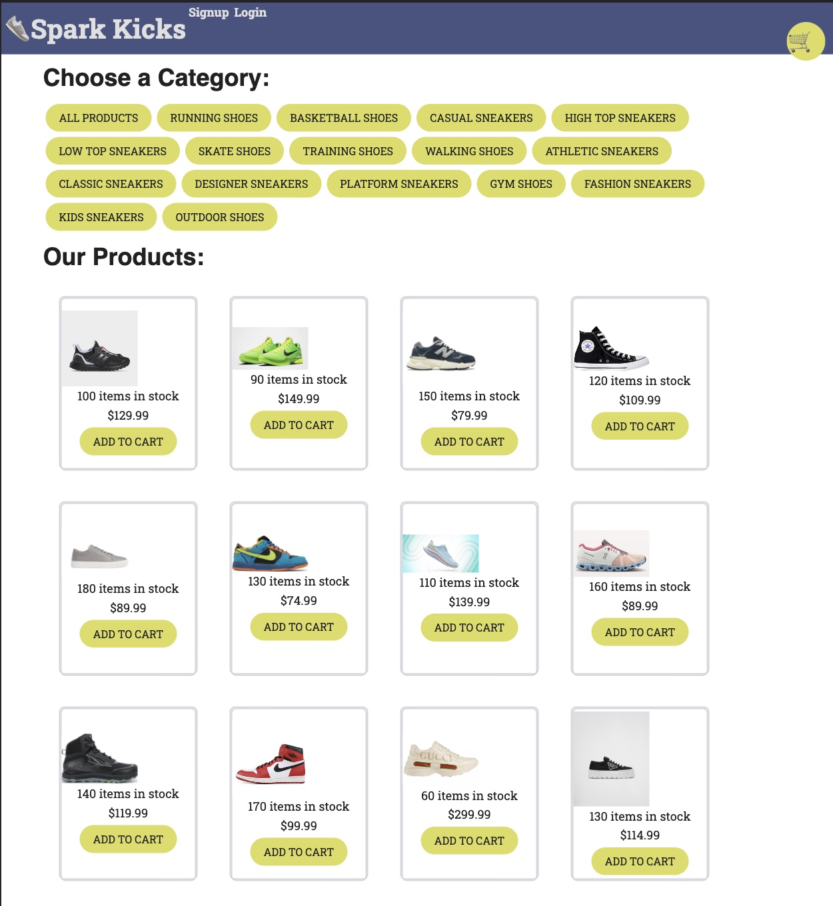

# Spark Kicks: Sneaker Reseller E-Commerce Website
Welcome to Spark Kicks, where sneaker culture comes to life. Our platform provides a dynamic and engaging marketplace for buying, selling, and exploring sneakers from various brands. Whether you’re a sneaker enthusiast or a seller, Spark Kicks is your destination for discovering the latest trends and connecting with fellow sneakerheads.
## Table of Contents
- [Overview](#overview)
- [Features](#features)
  - [Product Listings](#product-listings)
  - [Seller Dashboard](#seller-dashboard)
  - [User Authentication](#user-authentication)
  - [Stripe Payment System](#stripe-payment-system)
  - [Rating System](#rating-system)
- [Getting Started](#getting-started)
- [Installation](#installation)
- [Usage](#usage)
- [Technologies](#technologies)
- [Project Contributors](#contributing)
- [License](#license)
## Overview
Spark Kicks Sneaker Reseller E-Commerce Website is a comprehensive platform that brings together sneaker enthusiasts, buyers, and sellers. Explore our curated collection, list your sneakers for sale, and engage with a vibrant community that shares your passion for sneaker culture.
## Features
- **Product Listings:** Discover a diverse range of sneakers from various brands and styles.
- **Seller Dashboard:** Manage inventory, track orders, and communicate with buyers using a personalized dashboard.
- **User Authentication:** Register, log in, and access personalized features for a seamless shopping experience.
- **Stripe Payment System:** Utilize the Stripe payment system for seamless and secure payment processing.
- **Rating System:** Engage with the community by providing ratings and reviews for purchased sneakers.
## Getting Started
- Node.js and npm installed on your machine.
- MongoDB database set up and running.
### Installation
1. Clone the repository:
   ```sh
   git clone https://github.com/your-username/spark-kicks.git
   cd spark-kicks
   npm install
Set up your MongoDB database and configure environment variables.
### Usage
Start the server:
sh
Copy code
npm start
Access the website through your web browser by visiting http://localhost:3000.
Explore listings, engage with the community, make purchases using the secure Stripe payment system, and leave ratings and reviews.
### Technologies
Frontend: HTML, CSS, JavaScript
Backend: Node.js, Express.js
Database: MongoDB
Payment Processing: Stripe
Community Engagement: Ratings, reviews, discussions
Security: HTTPS, encryption
Responsive Design: Ensuring a consistent experience across devices
Contributing
We welcome contributions! If you’d like to contribute, please review our contribution guidelines.
### Screenshot/Deployed link

Deployed link:  https://sparkkicks-c49db95eae7a.herokuapp.com/
### License
This project is licensed under the MIT License.
## Project Contributors
This project was made possible by the following individuals:
- Hashim Mohamed
GitHub: [https://github.com/Hash33m]
- Ermiyas B.
GitHub: [https://github.com/Ermi-B]
- Tuji Abdulaya
GitHub: [https://github.com/tujiabdulaya]
- Abdulla Ahmed
GitHub: [https://github.com/Aiahmed01]
Join us at Spark Kicks and immerse yourself in the electrifying world of sneaker culture. Whether you’re a buyer, a seller, or simply a sneaker enthusiast, our platform is designed to enhance your journey. Connect with the community, discover the latest trends, and make your mark in the world of sneakers.
sparkkicks-c49db95eae7a.herokuapp.comsparkkicks-c49db95eae7a.herokuapp.com
:athletic_shoe:Spark Kicks
Web site created using create-react-app
GitHubGitHub
Hash33m - Overview
Hash33m has 18 repositories available. Follow their code on GitHub.
GitHubGitHub
Ermi-B - Overview
A work in Progress, check back later ;). Ermi-B has 27 repositories available. Follow their code on GitHub.--